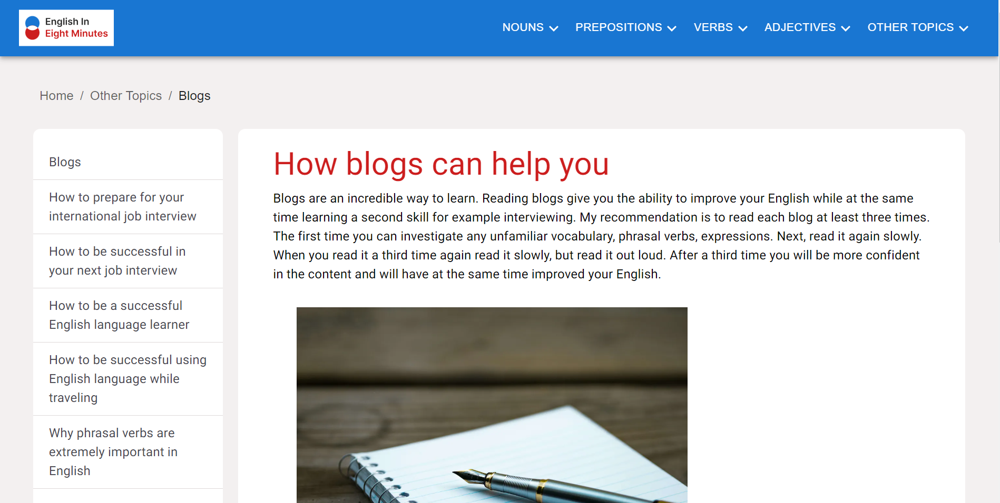
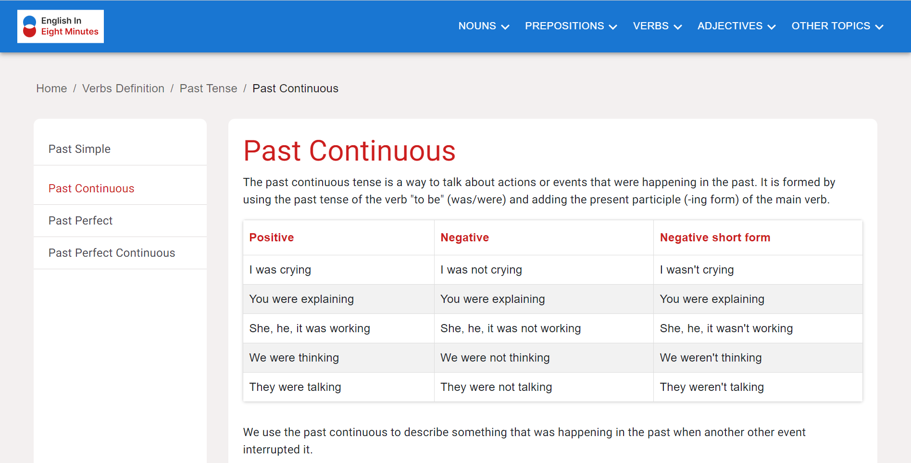
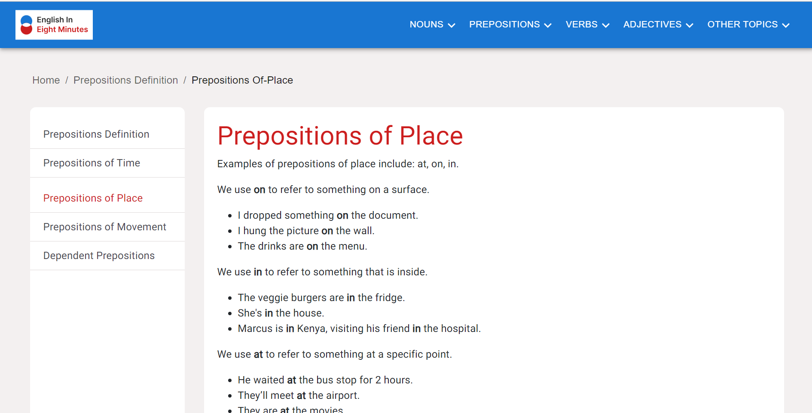

# English in Eight Minutes

  
  
  
  

I built this website for my English students. I saw that a lot of English grammar websites either had outdated uis or were too dense. My solution was to create an extremely easy user experience that is light and attractive. I used NextJS, Material UI and EmailJS. I also added Docker.

- **Documentation:**
    - [NextJS](https://nextjs.org/)  
    - [Material UI](https://mui.com/material-ui/)
    - [EmailJS](https://www.emailjs.com/docs/)
    - [Docker](https://www.docker.com/)

- **Backend:**
    - Node.js
    - TypeScript
    - Express.js
    - Database (e.g., MongoDB, PostgreSQL, etc.)
    - Unit Testing (jest, mocha, etc.)

## How To Run This Project

1. Clone project (in terminal add `git clone https://github.com/ChrisDietrich405/english-in-eight-next`)
2. Install dependencies (in terminal run `npm install`)
3. Run project (in terminal run `npm start`)

Open [http://localhost:3000](http://localhost:3000) to view it in the browser.

## Screenshots

Home Page

Blogs Page

Past Continuous Page

Past Continuous Page

=======
