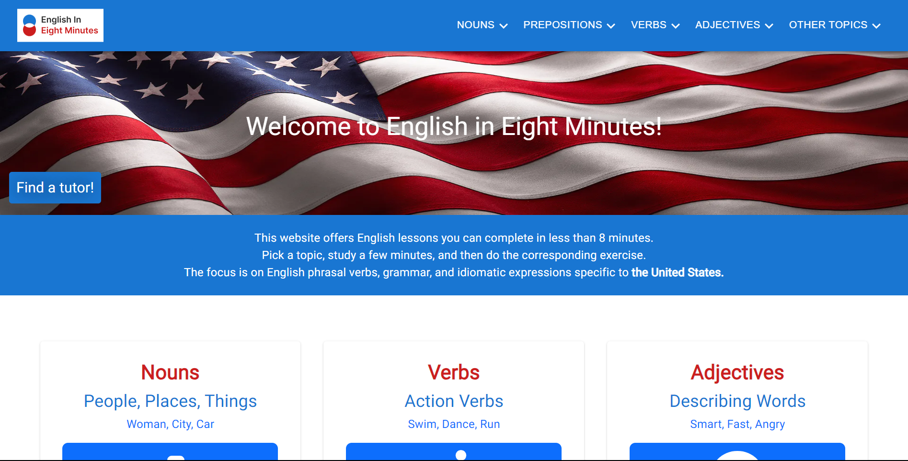

# dietrich-landcare-next

My oldest son needed a website for his business so here it is. For
this project I used object oriented programming. I used SASS for
the styling and the Emailjs library for the contact functionality.

## How To Run This Project

1. Clone project (in terminal add `git clone https://github.com/ChrisDietrich405/dietrich-landcare-react-final`)
2. Install dependencies (in terminal run `npm install`)
3. Run project (in terminal run `npm start`)

Open [http://localhost:3000](http://localhost:3000) to view it in the browser.

The page will reload if you make edits.\
You will also see any lint errors in the console.

## Screenshots

Home Page

Blogs Page

Past Continuous Page

Past Continuous Page

=======
