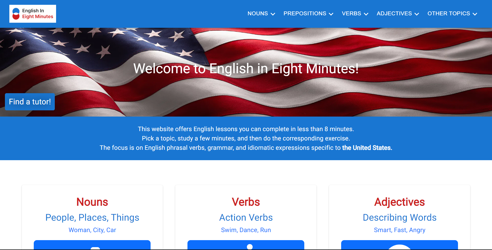
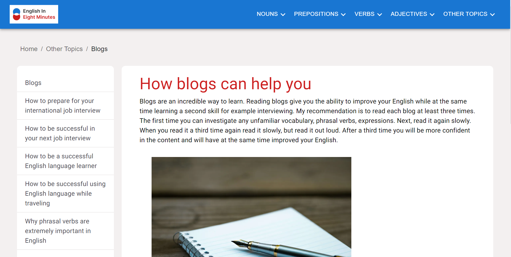
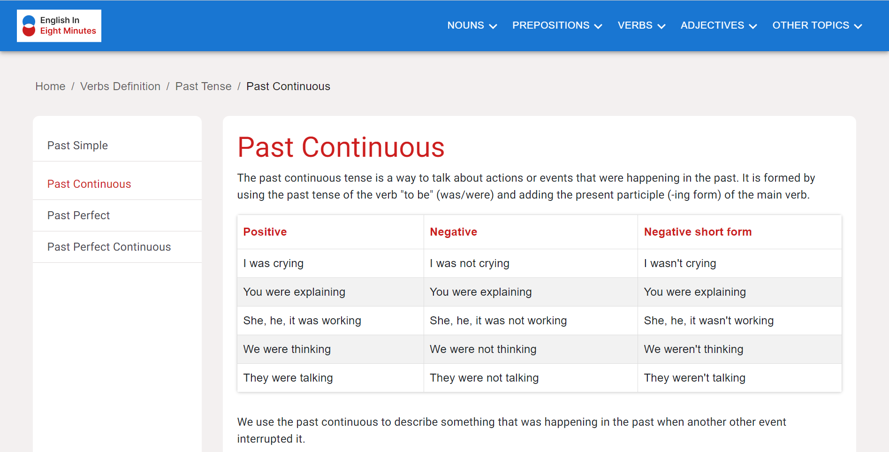
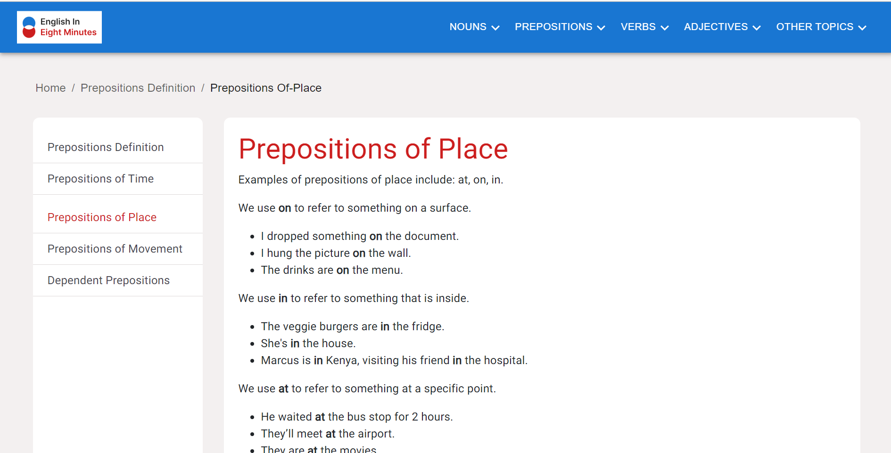

# English in Eight Minutes

<div align="center">
  
  
  
  
</div>
<br/>

I built this website for my English students. I saw that a lot of English grammar websites either had outdated UIs or were too dense. My solution was to create an extremely easy user experience that is light and attractive. I used NextJS, Material UI and EmailJS. I also added Docker.

- **Documentation:**
  - [NextJS](https://nextjs.org/)
  - [Material UI](https://mui.com/material-ui/)
  - [EmailJS](https://www.emailjs.com/docs/)
  - [Docker](https://www.docker.com/)

## How To Run This Project 📁

1. Install NodeJS version 16 or later
2. Clone this repository to your local machine using the following command:

```bash
git clone https://github.com/ChrisDietrich405/english-in-eight-next
```

3. Install dependencies (in terminal run `npm install`)
4. Run project (in terminal run `npm start`)

Open [http://localhost:3000](http://localhost:3000) to view it in the browser.

## How To Run This Project Using Docker

1. Download and install Docker https://www.docker.com/get-started/

2. Build docker image.
   This command will use the project's DockerFile to create a docker image of the project.

```bash
docker build -t english-in-eight-next .
```

3. Run docker container

```bash
docker run -d -p 3000:3000 english-in-eight-next
```

4. Check to see if it worked.
   Open http://localhost:3000 to see if earthsave-baltimore is running in the container

## Screenshots

Home Page



Blogs Page



Past Continuous Page



Prepositions Page

# 
